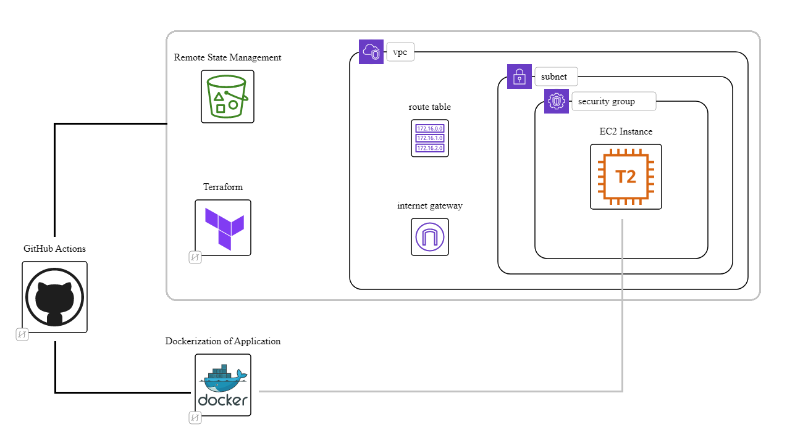

# Automated Lifecycle of an Application

## Introduction
This project intends to serve as a demonstration as to how DevOps methodologies enhance the software development process. It's a brief and simple implementation of services like Terraform, Docker and GitHub Actions to provision and bootstrap an EC2 instance, build a React application and pushing it to Dockerhub, and deploying the Docker image to the provisioned server.

## Future Plans
Since the project covers the entire SDLC, I intend to extend this project functionalities and add 2 dashboards. 

- [ ] Prometheus + Grafana dashboard for server monitoring
- [ ] ELK Stack dashboard for Logs monitoring
  - [ ] Packer for AMIs

